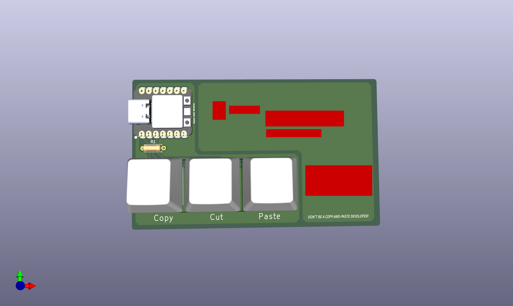

# PCB_BusinessCard 実装ドキュメント
## 準備物
| 必要物 | 個数 | 備考 |
| -- | -- | -- |
| Seeed XIAO RP2040 | 1x | https://akizukidenshi.com/catalog/g/g117044/ |
| 抵抗2.2MΩ | 1x | 例: https://akizukidenshi.com/catalog/g/g112113/ |
| Cherry MX キースイッチ またはその互換品 | 3x | 打鍵音や見た目などは個人の好みによるため，各自で用意 | 
| Cherry MX互換キースイッチ用キーキャップ | 3x | こちらも各自で好みのものを用意 |

それぞれはんだ付けする．実装イメージとしては以下のようになる．


## プログラム書き込み
`CircuitPython`と呼ばれるAdafruit社が開発したPythonコンパイラを使用することでUSBデバイスとしての振る舞いを持たせることができ，そのキーボードライブラリを使用してマクロパッドを作成する．

[こちらのCircuitPython公式ページ](https://circuitpython.org/board/seeeduino_xiao_rp2040/)からCircuitPythonのファームウェアである.`uf2`ファイルをダウロードする．


次に，マイコンのBボタン（ブートボタン）を押しながらパソコンのUSBポートに接続する．
すると，`RPI-PR2`という名前でストレージとして認識してされるはずである．ここに，先程ダウンロードした.`uf2`ファイルをドラッグアンドドロップ（コピペ）する．


すると，少し時間が経ってマイコンがアンマウントされるはずである．もしアンマウントされたままであれば一度抜き差しし，今度はCIRCUITPYドライブとして認識されると思う．


`lib`フォルダにライブラリを入れることができる．必要なライブラリを[このサイト](https://github.com/adafruit/Adafruit_CircuitPython_Bundle/tags)から選んでこのlibフォルダの中に入れるとよい．

日付ごとに分けられているが，最新のものを選ぶと良い．※もしダウンロードしたもので関数の仕様等が変更されてうまく動作しない場合，少なくとも写真の通り[2025年3月14日のもの](https://github.com/adafruit/Adafruit_CircuitPython_Bundle/tags?after=20250408)では動くということなので，そちらのダウンロードを試してほしい．


下のzipをダウンロードして解凍．


解凍したファイルの中に`lib`フォルダがあるので，こちらから必要なライブラリを`CIRCUITPY`の方の`lib`フォルダにコピーする．全部コピペでいいかと思うかもしれないが，それだとマイコン側のストレージが足らないので，選択的にコピペすることになる．


マクロパッドとしての機能に必要なライブラリは`adafruit_hid`ライブラリなので，それを`CIRCUITPY/lib`下にコピペする．


`code.py`をテキストエディタで開いて以下のコードを貼り付ける．

```Python
import time
import board
import digitalio
import usb_hid
from adafruit_hid.keyboard import Keyboard
from adafruit_hid.keycode import Keycode

# HIDキーボード初期化
kbd = Keyboard(usb_hid.devices)

# ボタン設定
SW1 = digitalio.DigitalInOut(board.D0)
SW2 = digitalio.DigitalInOut(board.D1)
SW3 = digitalio.DigitalInOut(board.D2)
for sw in (SW1, SW2, SW3):
    sw.direction = digitalio.Direction.INPUT
    sw.pull = digitalio.Pull.UP  # プルアップしておく

# 前回状態（負論理：True=未押下, False=押下）
prev = [True, True, True]

# バウンス用の待ち時間（秒）
DEBOUNCE = 0.02

while True:
    curr = [SW1.value, SW2.value, SW3.value]

    # 立ち下がりエッジ（未押下→押下）で1回だけ送信
    if curr[0] is False and prev[0] is True:  # SW1 pressed
        time.sleep(DEBOUNCE)
        if SW1.value is False:
            kbd.send(Keycode.CONTROL, Keycode.C)  # Copy

    if curr[1] is False and prev[1] is True:  # SW2 pressed
        time.sleep(DEBOUNCE)
        if SW2.value is False:
            kbd.send(Keycode.CONTROL, Keycode.X)  # Cut

    if curr[2] is False and prev[2] is True:  # SW3 pressed
        time.sleep(DEBOUNCE)
        if SW3.value is False:
            kbd.send(Keycode.CONTROL, Keycode.V)  # Paste

    prev = curr
    time.sleep(0.01)  # ポーリング間隔
```

保存してしばらくするとマクロパッドとしての処理が実行される．自動で実行されない場合はRボタン（リセットボタン）を押す，USB接続を抜き差しするなどしてプログラムを読み込ませる．