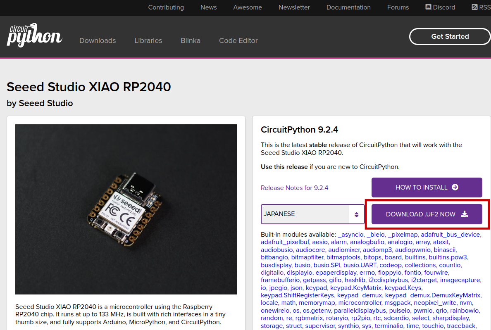

# PCB_BusinessCard 実装ドキュメント
## CircuitPythonの準備
`CircuitPython`と呼ばれるAdafruit社が開発したPythonコンパイラを使用することでUSBデバイスとしての振る舞いを持たせることができ，そのキーボードライブラリを使用してマクロパッドを作成する．

[こちらのCircuitPython公式ページ](https://circuitpython.org/board/seeeduino_xiao_rp2040/)からCircuitPythonのファームウェアである.uf2ファイルをダウロードする．

準備中