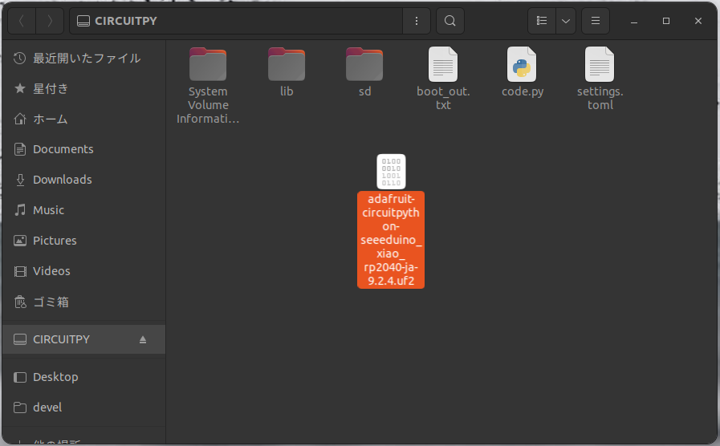
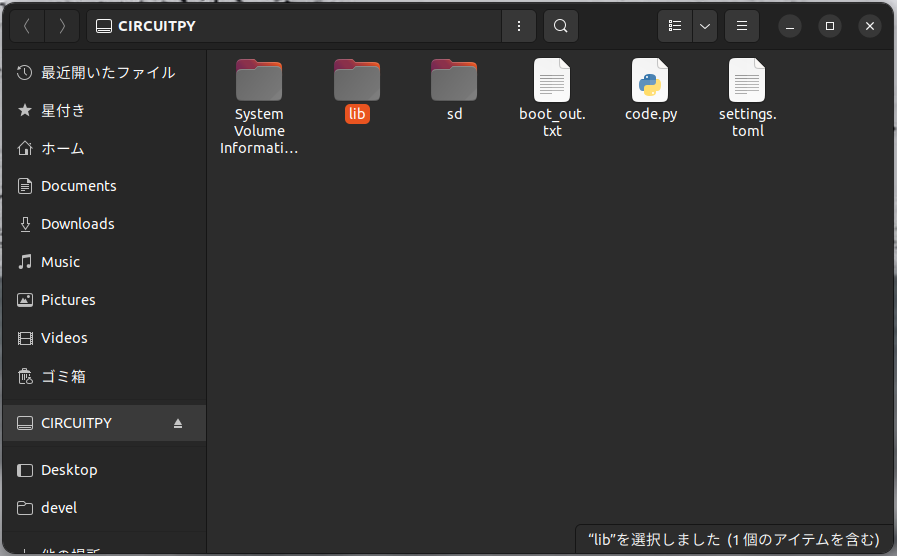
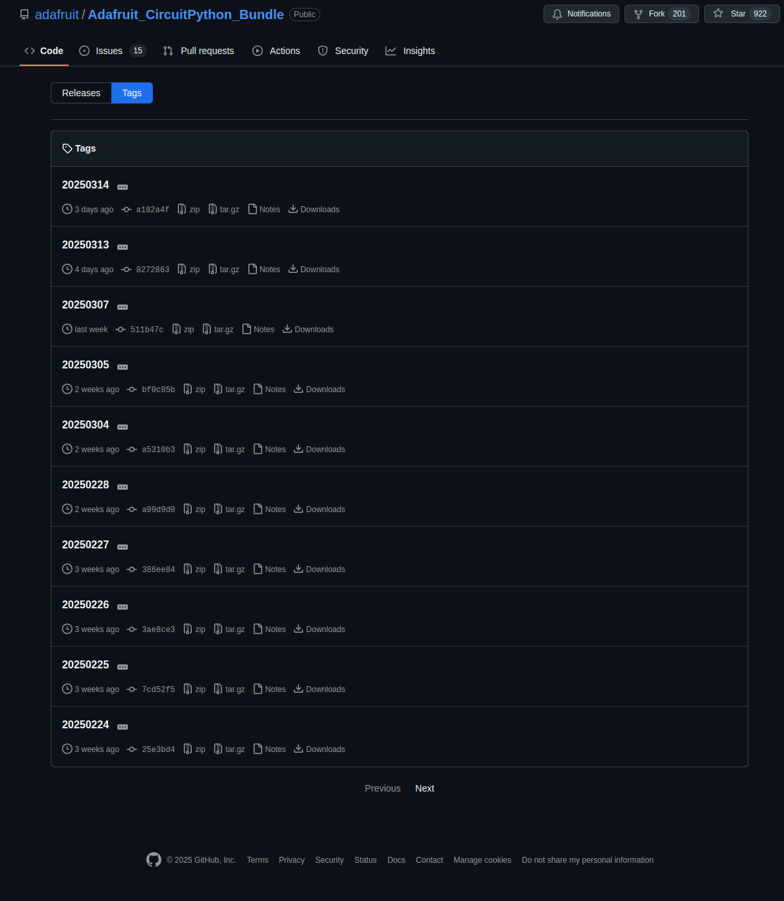
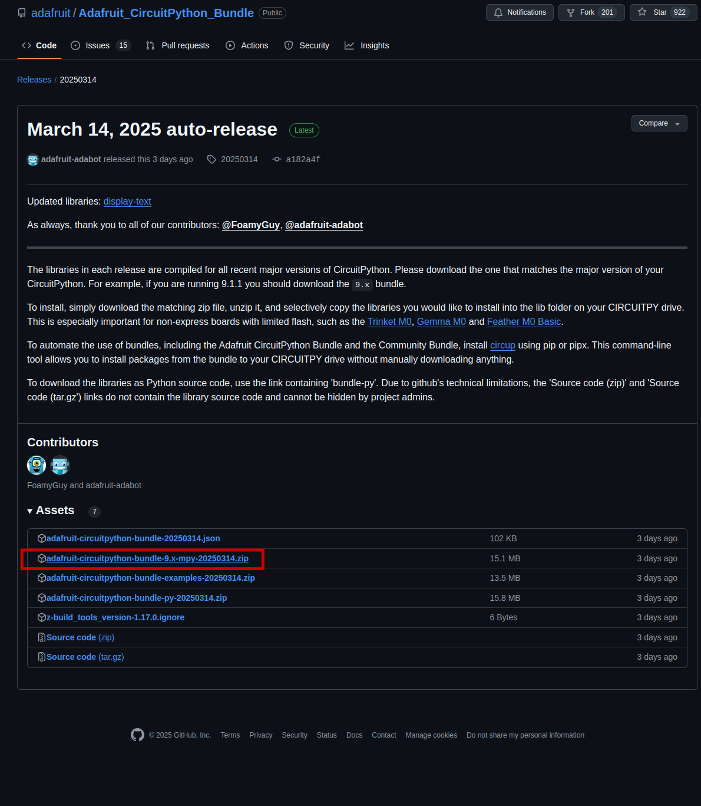
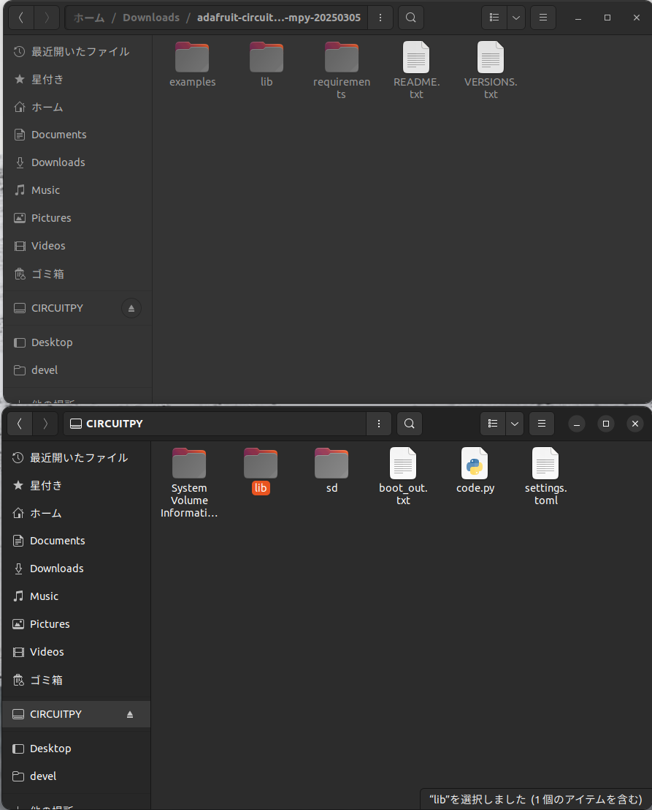
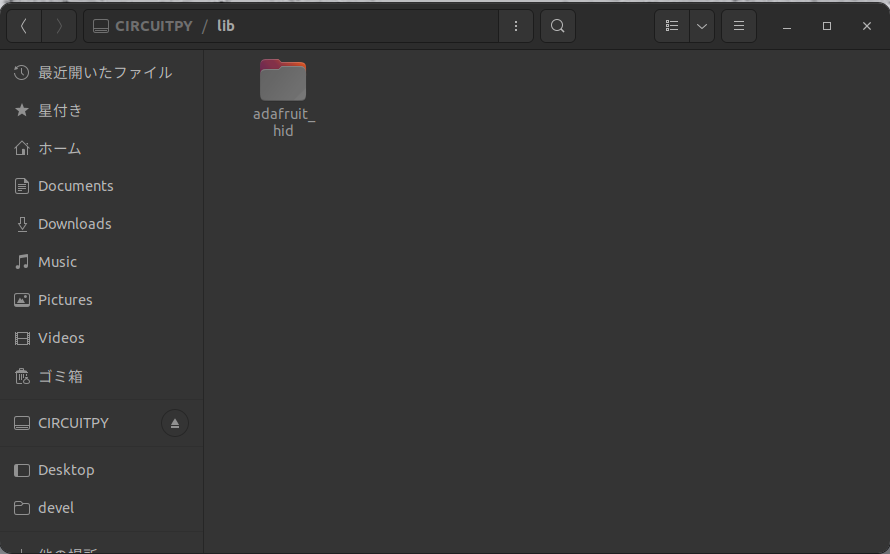

# PCB_BusinessCard 実装ドキュメント
## CircuitPythonの準備
`CircuitPython`と呼ばれるAdafruit社が開発したPythonコンパイラを使用することでUSBデバイスとしての振る舞いを持たせることができ，そのキーボードライブラリを使用してマクロパッドを作成する．

[こちらのCircuitPython公式ページ](https://circuitpython.org/board/seeeduino_xiao_rp2040/)からCircuitPythonのファームウェアである.uf2ファイルをダウロードする．

次に，マイコンのBボタンを押しながらパソコンのUSBポートに接続する．
すると，`RPI-PR2`という名前でストレージとして認識してされるはずである．ここに，先程ダウンロードした.`uf2`ファイルをドラッグアンドドロップ（コピペ）する．

すると，少し時間が経ってマイコンがアンマウントされるはずである．もしアンマウントされたままであれば一度抜き差しし，今度はCIRCUITPYドライブとして認識されると思う．

`lib`フォルダにライブラリを入れることができる．必要なライブラリを[このサイト](https://github.com/adafruit/Adafruit_CircuitPython_Bundle/tags)から選んでこのlibフォルダの中に入れるとよい．

日付ごとに分けられているが，最新のものを選ぶと良い．

下のzipをダウンロードして解凍．

回答したファイルの中に`lib`フォルダがあるので，こちらから必要なライブラリを`CIRCUITPY`の方の`lib`フォルダにコピーする．全部コピペでいいかと思うかもしれないが，それだとマイコン側のストレージが足らないので，選択的にコピペすることになる．

マクロパッドとしての機能に必要なライブラリは`adafruit_hid`ライブラリなので，それを`CIRCUITPY/lib`下にコピペする．

これでマイコンに`Circuitpython`でプログラムする準備は整った．